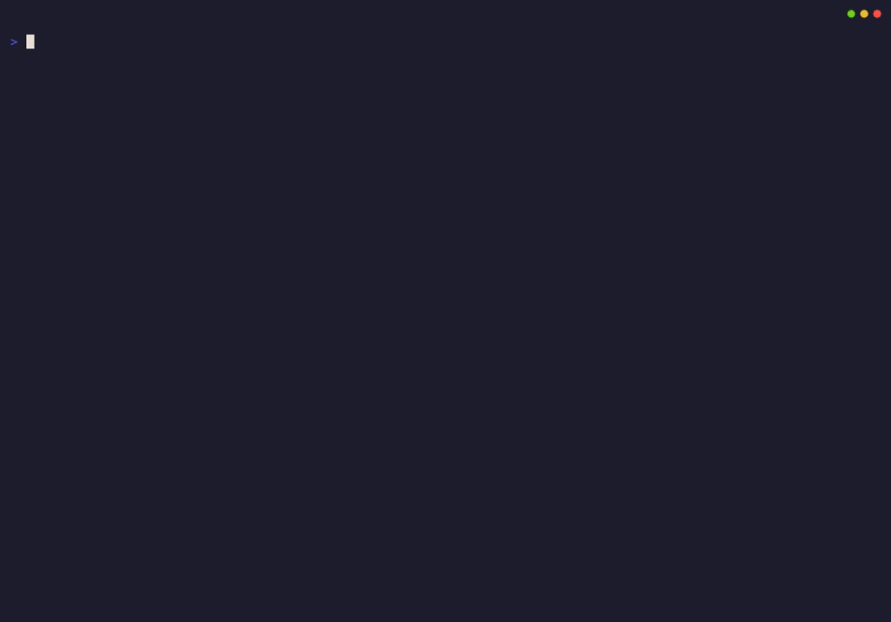

# Jivetalking 🕺

Raw microphone recordings into broadcast-ready audio in one command. No configuration, and no surprises.

```bash
jivetalking presenter1.flac presenter2.flac
```

Your files emerge at -16 LUFS, a common podcast target, with room rumble, background hiss, clicks, and harsh sibilance sorted automatically. Multiple files process in parallel, each with its own TUI progress row. Everything needed is embedded in the binary. This is not how audio tools usually work, and that is rather the point.

## Example Output

<div align="center"></div>

---

## The Four-Pass Pipeline

Jivetalking treats audio processing as measurement science, not guesswork. It analyses your recording first, then adapts every filter to match. A dark-voiced narrator gets gentler de-essing, pre-compressed audio gets lighter compression, and a noisy home office gets different treatment than a clean studio.

Four passes carry a raw recording to a broadcast-ready master:

1. **Analyse:** measure loudness, noise floor, and speech; detect the room tone.
2. **Process:** run the adapted filter chain.
3. **Measure:** read the processed signal back so normalisation has accurate numbers.
4. **Normalise:** set the final loudness to -16 LUFS / -1 dBTP.

The Pass 2 filter chain, each stage handing the next a cleaner signal:

```text
downmix → rumble high-pass → band-limit low-pass → noise reduction → speech gate → levelling compressor → de-esser → analysis → resample
```

For the full walkthrough, see **[docs/Pipeline.md](docs/Pipeline.md)**: what each stage does, why it sits where it does, how the adaptive tuning works, and how normalisation reaches -16 LUFS honestly, with a diagram.

---

## Quality Ratings

When a file finishes, the completion box shows two star ratings:

```
Recording   ★★☆☆☆  Fair
Processed   ★★★★★  Excellent
```

**Recording** grades your source capture, the raw audio you fed in. This is the one that varies, and the one you can act on. **Processed** grades the output against the -16 LUFS broadcast target, and it is usually five stars, because hitting that target is jivetalking's job and it reliably does. Side by side, the pair tells the story: we took your two-star capture to a five-star master.

The Recording score looks at three things, in plain terms:

- **Clean:** low background hiss and a healthy gap between your voice and the room
- **Headroom:** no clipping; a capture recorded too hot scores zero here
- **Level:** recorded at a sensible loudness, without wild swings

Scores run 1 to 5 stars (Poor, Fair, Good, Great, Excellent). The scale is grounded on a real podcast corpus, so the stars mean something rather than being plucked from the air.

A low Recording star is a hint to improve the capture next time: record in a quieter room, back the gain off so peaks do not clip, and get the level up if it is too quiet. Either way, jivetalking still rescues the file to a broadcast-ready master.

---

## Installation

Single binary. Zero external dependencies. FFmpeg is embedded via ffmpeg-statigo.

### bin (Recommended)

Install with [bin](https://github.com/marcosnils/bin), a GitHub-aware binary manager:

```bash
bin install github.com/linuxmatters/jivetalking
```

This picks the correct platform and architecture, drops the binary into `~/.local/bin/`, and handles updates via `bin update`. No root required, no path wrangling.

### Manual Download

Fetch from the [releases page](https://github.com/linuxmatters/jivetalking/releases):

```bash
# Linux amd64
chmod +x jivetalking-linux-amd64
mv jivetalking-linux-amd64 ~/.local/bin/jivetalking

# Linux arm64
chmod +x jivetalking-linux-arm64
mv jivetalking-linux-arm64 ~/.local/bin/jivetalking

# macOS Intel
chmod +x jivetalking-darwin-amd64
mv jivetalking-darwin-amd64 ~/.local/bin/jivetalking

# macOS Apple Silicon
chmod +x jivetalking-darwin-arm64
mv jivetalking-darwin-arm64 ~/.local/bin/jivetalking
```

---

## Usage

```bash
jivetalking [flags] <files...>
```

### Flags

| Flag | Description |
|------|-------------|
| `-v, --version` | Show version and exit |
| `-a, --analysis-only` | Run analysis only (Pass 1), display results, skip processing |
| `-d, --debug` | Enable debug logging to `jivetalking-debug.log` |
| `--diagnostics` | Write extra diagnostic artefacts: before/after spectrogram PNGs plus `.intervals.jsonl`/`.candidates.jsonl` sidecars. Adds extra FFmpeg passes. Off by default |
| `--room-tone-scan-duration=DURATION` | Cap room-tone candidate scan to the first `DURATION` of input (e.g. `30s`, `1m30s`). Default `0s` scans the whole file |
| `--silence-scan-duration=DURATION` | Deprecated alias for `--room-tone-scan-duration`; still accepted for backwards compatibility |


### Examples

```bash
# Process multiple presenters in parallel (worker count tracks file count)
jivetalking presenter1.flac presenter2.flac presenter3.flac

# Inspect recordings without processing
jivetalking -a presenter1.flac presenter2.flac

# Debug a problematic recording
jivetalking -d troublesome-recording.flac

# Process all FLAC files in directory
jivetalking *.flac

# Emit before/after spectrograms and interval sidecars
jivetalking --diagnostics presenter1.flac
```

Processing always writes a Markdown report next to each processed output. For example, `recording-LUFS-16-processed.flac` gets `recording-LUFS-16-processed.md`. The report is empirical: every measurement and the exact adapted filter parameters, with objective metric definitions and no quality verdicts. Analysis-only runs write `<input>-analysis.md` instead.

### Limiting room-tone scan duration

Long recordings can spend disproportionate time scoring room-tone candidates across the whole file. `--room-tone-scan-duration` caps that scan to the first `DURATION` of input, trading coverage for speed. Loudness, true peak, LRA, spectral statistics, and speech detection still see the whole file; only room-tone candidate collection is constrained, so fewer candidates reach voice-activated detection when the cap is engaged. The flag accepts Go duration syntax (`30s`, `1m`, `2m30s`); the default `0s` scans the whole file. Works with `--analysis-only` as well. The legacy `--silence-scan-duration` flag remains accepted as a deprecated alias.

```bash
# Cap room-tone scanning to the first 30 seconds
jivetalking --room-tone-scan-duration=30s presenter1.flac

# One minute prefix
jivetalking --room-tone-scan-duration=1m presenter1.flac

# Two and a half minutes, analysis only
jivetalking -a --room-tone-scan-duration=2m30s presenter1.flac
```

### Diagnostics

`--diagnostics` writes extra artefacts beside the report for sweeps and before/after comparison. It changes no DSP, so the processed audio is byte-identical with the flag on or off; it only adds FFmpeg passes to render the extras. The flag emits:

- **Before/after spectrogram PNGs**, named `<name>-LUFS-NN-processed.spectrogram-<kind>-<stage>.png`. `<kind>` is `whole`, `roomtone`, or `speech`; `<stage>` is `before` or `after`. Each before/after pair shares identical dimensions and scales for an honest side-by-side. Analysis-only emits `input` spectrograms (no "after"). The Markdown report links them in a `## Spectrograms` section.
- **Interval sidecars** `<name>.intervals.jsonl` and `<name>.candidates.jsonl`, the raw 250 ms interval samples and scored room-tone candidates. The report's inline summaries cover the common case, so these are only needed for deep analysis.

### Analysis-Only Mode

Pass `-a` to run only Pass 1 analysis, printing a detailed report to the console without creating any output files. Useful for quickly understanding what jivetalking sees in your recordings, diagnosing setup problems, or checking whether a file needs processing at all.

The report covers:

- **Loudness & dynamics**: integrated LUFS, true peak, loudness range, crest factor
- **Room tone & speech detection**: candidate regions scored and elected for noise profiling and speech-aware metrics; voice-activated recording detected automatically (Riverside, Zencastr)
- **Derived measurements**: noise floor, gate baseline, noise-to-speech headroom
- **Filter adaptation**: the exact parameters jivetalking would apply: highpass frequency, gate threshold, NR settings, de-esser intensity, levelling-compressor configuration
- **Spectral summary**: full spectral characterisation with human-readable interpretations
- **Recording score and gain advice**: the same Recording star rating shown after processing, plus a one-line input-gain verdict (see below)

#### Gain advice

Analysis mode is the place to fix your capture before you commit to a take. Alongside the Recording stars, each file gets a single-line verdict and a five-cell thermometer bar that fills with your input true peak, running cyan (quiet) through green (well set) to red (clipping):

```
Recording  ★★☆☆☆  Fair
Gain       ▰▱▱▱▱  Quiet. Peaks at -14.2 ㏈TP. Raise input gain ~8 ㏈.
```

The verdict reads `Interpretation. Level. Advice.` and keys off the input true peak alone, with a target of -6 ㏈TP:

| State | Input true peak | Advice |
|-------|-----------------|--------|
| **Clipping** | ≥ 0 ㏈TP | Lower input gain by the stated amount |
| **Hot** | -1 to 0 ㏈TP | Lower input gain by the stated amount |
| **Well set** | -12 to -1 ㏈TP | No action required |
| **Quiet** | < -12 ㏈TP | Raise input gain by the stated amount |

The stars and the gain advice are console-only: the Markdown report stays empirical and verdict-free.

Example output (trimmed):

```
======================================================================
ANALYSIS: presenter1.flac
======================================================================
Duration:    5m 23s
Sample Rate: 48000 Hz
Channels:    mono

LOUDNESS
  Integrated:     -32.4 LUFS
  True Peak:      -6.0 dBTP
  Loudness Range: 18.2 LU

DERIVED MEASUREMENTS
  Noise Floor:    -52.3 dBFS (from elected room tone)
  Gate Baseline:  -46.0 dB (noise floor + margin)
  NR Headroom:    19.9 dB (noise-to-speech gap)

FILTER ADAPTATION
  Highpass:       80 Hz (from spectral analysis)
  Gate Threshold: -40.2 dB (with breath reduction)
  Gate Ratio:     2.0:1
  NR Threshold:   -47 dB
  NR Expansion:   8 dB
  De-esser:       32% intensity
  Comp Thresh:    -28 dB
  Comp Ratio:     3.2:1

Recording  ★★★☆☆  Good
Gain       ▰▰▰▱▱  Level well set. Peaks at -6.0 ㏈TP. No action required.
```

Output files are named with the measured LUFS value: `recording.flac` becomes `recording-LUFS-16-processed.flac`.

---

## The Typical Workflow

```
Record → Process → Edit → Finalise
  │         │         │         │
  │         │         │         └─ Export at -16 LUFS (dual-mono)
  │         │         │
  │         │         └─ Import to Audacity, top/tail, mix to mono
  │         │
  │         └─ $ jivetalking *.flac (-16 LUFS, matched levels)
  │
  └─ Each presenter records separately, exports FLAC
```

**Include 10-15 seconds of room tone somewhere in your recording.** Just sit quietly and let the room breathe - at the start, between sections, or at the end. Jivetalking scans the entire file to find the cleanest room-tone section for building a noise profile, which calibrates the adaptive gate and highpass in Pass 2. The `anlmdn → afftdn` noise reduction runs regardless, so recordings without a clean room-tone section are still denoised.

---

## Development

Requires Go, Nix, and a tolerance for CGO.

```bash
# Enter development shell (FFmpeg dependencies provided)
nix develop

# Initialise submodules (ffmpeg-statigo provides embedded FFmpeg)
just setup

# Download static FFmpeg libraries
cd third_party/ffmpeg-statigo && go run ./cmd/download-lib

# Build (never use go build directly - requires CGO + version injection)
just build

# Run tests
just test

# Install to ~/.local/bin
just install
```

### Project Structure

```
cmd/jivetalking/main.go     # CLI entry, Kong flags, Bubbletea TUI
internal/
├── audio/reader.go         # FFmpeg demuxer/decoder wrapper
├── processor/
│   ├── analyzer.go         # Pass 1: ebur128 + astats + aspectralstats
│   ├── processor.go        # Pass 2: adaptive filter chain execution
│   ├── filters.go          # BaseFilterConfig, EffectiveFilterConfig, BuildFilterSpec()
│   └── adaptive.go         # Measurement-driven parameter tuning
├── ui/                     # Bubbletea model, views, messages
└── cli/                    # Help styling, version output
```

### Design Documentation

- [Audio Pipeline](docs/Pipeline.md): how and why the processing pipeline is built and tuned, with a diagram
- [The hardware that taught me](docs/Inspiration.md): the influences and heritage behind jivetalking's processing approach
- [Spectral Metrics Reference](docs/Spectral-Metrics-Reference.md): how measurements drive adaptation

See [AGENTS.md](AGENTS.md) for complete development guidelines, architecture details, and contribution standards.

---

## Contributing

```bash
# Run tests before committing
just test
```

- Follow [Conventional Commits](https://www.conventionalcommits.org/) format
- Use `just build` for any releases (CGO + version injection required)
- GitHub Actions builds binaries for linux-amd64, linux-arm64, darwin-amd64, darwin-arm64 automatically
