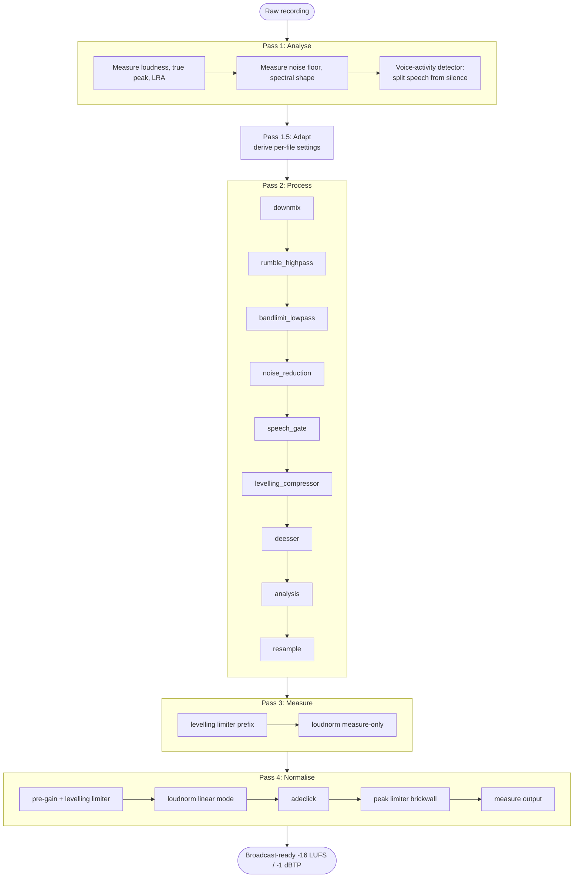

# Pipeline

How Jivetalking turns a raw voice recording into a broadcast-ready file at
-16 LUFS / -1 dBTP, and why each stage is built and tuned the way it is. Written
for an audio engineer or a curious podcast creator: it explains the *what* and
the *why* in plain audio terms, not the FFmpeg source line by line.

## The big picture: four passes

Jivetalking processes one file in four passes, with a short derivation step
between the first two. It measures first, decides second, treats third, measures
the result, and sets the loudness last.

1. **Analyse (Pass 1).** Read the whole file and measure it: loudness (LUFS),
   true peak, loudness range (LRA), noise floor, and spectral shape. Detect the
   quiet gaps (room tone) and the spoken passages (speech) with a single
   voice-activity detector that samples the file in 250 ms intervals. Nothing is
   changed; this pass only listens.
   - **Adapt.** Between Pass 1 and Pass 2, those measurements become per-file
     filter settings. The gate threshold sits just below the softest words; a
     quiet recording gets the same levelling as a loud one; sibilant material
     gets more de-essing. It is a pure calculation, no audio is touched (shown as Pass 1.5
     in the diagram). Only the settings that genuinely benefit from the
     measurements are adapted; the rest are fixed at values that are correct for
     spoken word.
2. **Process (Pass 2).** Run the adapted filter chain: downmix, clean up the
   frequency extremes, reduce noise, gate the gaps, level the dynamics, tame
   sibilance, then measure the result for comparison.
3. **Measure (Pass 3).** Run loudnorm in measure-only mode over the processed
   signal, through the same limiter prefix Pass 4 will apply, so the loudness
   pass gets accurate numbers to work from.
4. **Normalise (Pass 4).** Set the final loudness to -16 LUFS using loudnorm in
   linear mode, with a limiter ahead of it to create the headroom that keeps
   loudnorm linear, and a final brickwall limiter that delivers -1 dBTP.

The audio output is identical whether or not diagnostics are enabled; the
`--diagnostics` flag only adds reports and spectrograms, it never touches the
signal.

## The whole pipeline



## The Pass 2 filter chain

```text
downmix → rumble_highpass → bandlimit_lowpass → noise_reduction → speech_gate → levelling_compressor → deesser → analysis → resample
```

The order is deliberate. Each stage hands the next one a cleaner signal to work
on.

## Stage by stage through Pass 2

### downmix

**What:** Folds the input to a single mono channel.

**Why here, first:** Every downstream filter measures and treats one channel.
Downmixing first means the gate, compressor, and de-esser see one consistent
signal rather than two channels that might drift apart. Podcast voice is mono in
practice, so nothing of value is lost.

### rumble_highpass

**What:** A fixed 80 Hz high-pass, 12 dB/octave (2-pole Butterworth).

**Why:** Removes subsonic rumble (HVAC, footfalls, desk knocks, mic handling)
before anything else acts on the signal. 80 Hz sits below every vocal
fundamental with margin (the lowest measured male voice is around 91 Hz, female
165 Hz and up), so it clears the rumble without thinning the voice.

**Why here:** It runs before the gate so the gate's level detector is not fooled
by low-frequency energy that the listener cannot hear. This is the
"frequency-conscious gating" idea: clean the spectrum the gate listens to before
the gate decides. It is fixed, not adaptive, because the correct corner is the
same for every voice.

### bandlimit_lowpass

**What:** An unconditional 20.5 kHz low-pass, 12 dB/octave.

**Why:** Caps the top of the band at the edge of human hearing. It removes only
inaudible ultrasonics, which the downstream lossy encoders (AAC, Opus, MP3)
would discard anyway, and gives every file a consistent bandwidth going into
those encoders.

**Why here:** Paired with the high-pass, it trims the other frequency extreme
before the gate, completing the band the gate listens to. It is fixed at
20.5 kHz with no content detection; the band-limit is audibly transparent, so
there is nothing to adapt.

### noise_reduction

**What:** Two denoisers in series. First a non-local-means time-domain denoiser
that finds and averages similar patches of waveform; then an FFT spectral
denoiser that suppresses the broadband hiss left under the speech.

Non-local means is borrowed from image processing. It was devised to clean
photographs by replacing each patch with a weighted average of the patches that
most resemble it from anywhere in the frame, near or far, and it has since become
a mainstay of medical imaging, where it is widely used to denoise MRI scans
without blurring fine anatomical detail. FFmpeg applies the same principle to a
one-dimensional audio signal: it compares short windows of the waveform, a few
milliseconds wide, and averages the ones that match. Steady hiss, which repeats
all across the recording, is averaged away; speech, which rarely repeats exactly,
is left standing.

**Why:** The first stage lifts the obvious noise; the second cleans the residual
floor under the voice that the first stage and the gate cannot reach. The FFT
stage replaced an older downward expander that pumped the floor; the two-denoiser
pairing keeps the gaps clean with less floor modulation.

**Why here:** Denoising runs **before** the gate so the gate sees a lower, more
stable noise floor. That lets the gate set its threshold closer to the noise and
open and close more cleanly.

**When the FFT stage switches off:** On voice-activated recordings the FFT
denoiser is turned off automatically and the time-domain denoiser runs alone.
These are captures from platforms that mute the line between phrases, so the gaps
are true digital silence rather than a steady background. The FFT stage has no
constant hiss to learn from there, and its noise tracking can warble on the
silence, so the pipeline drops it. The on-screen **Denoise** readout shows "NLM"
on these files instead of the usual "NLM+FFT". In testing the FFT stage helped
about a fifth of the recordings, did nothing either way on most, and only hurt
the voice-activated captures, so it is switched off exactly there and left on
everywhere it helps or does no harm.

**How the FFT stage uses the measured floor:** When it does run, the FFT denoiser
is told the file's actual noise level (the noise floor the pipeline already
measured in Pass 1) and its own internal noise tracking is turned off. It then
subtracts against the real measured floor rather than guessing and drifting frame
to frame. Testing showed this removes a touch more background on average, with no
change to the voice and no warble.

**What is fixed:** The FFT reduction strength is pinned at 12 dB and is
deliberately *not* adaptive: a per-voice sweep showed the noisiest voice has to be
capped near 12 dB to avoid musical "warble" artefacts, so a stronger setting would
do harm. The time-domain denoiser runs at a fixed, validated strength too. What
adapts is the FFT stage's on/off decision and the noise floor it works against,
both described above.

### speech_gate

**What:** A soft expander (a gentle gate) that pulls down the level in the gaps
between words without chewing on the speech itself.

**Why:** It cleans the silence between phrases so the recording sounds tidy,
while leaving the voice within a phrase untouched. A soft expander (low ratio)
rather than a hard gate keeps the transitions natural.

**Why here:** It runs after denoising (lower floor to work against) and before
the compressor and de-esser, so it removes the inter-speech noise before those
stages can lift it.

**What adapts** (see *Adaptive tuning* below): the threshold is placed from the
measured soft-speech level, and the range (how deep it pulls the gaps down) and
the ratio track the Pass 1 measurements. The attack (5 ms), the release
(200 ms), the knee, and RMS detection are fixed.

### levelling_compressor

**What:** A gentle, programme-dependent compressor: 3:1 ratio, 10 ms attack,
200 ms release, soft knee, no makeup gain.

**Why:** It evens out the loud-to-quiet swing of the delivery so the later
loudness normalisation has a steadier signal to work with. The goal is to level,
not to flatten, so the settings are deliberately mild and the loudness pass, not
the compressor, sets the final level (hence no makeup gain here).

**Why here:** It runs before the de-esser because compression brings up the
quieter detail, including sibilance, so de-essing afterwards acts on what the
listener will actually hear.

**What adapts:** only the threshold, anchored to the measured speech RMS (see
below). Ratio, attack, release, knee, and mix are fixed.

### deesser

**What:** Reduces harsh "s", "sh", and "t" sibilance in the 6-9 kHz band.

**Why:** Sibilance that was tolerable in the raw take can become harsh once the
signal is compressed and normalised. The de-esser targets the sibilant band
(corner around 7.5 kHz) so it acts on the hiss, not on vocal presence.

**Why here:** Last of the tonal stages, after the compressor that emphasises
sibilance, so it corrects the final tonal balance.

**What adapts:** only the intensity, and only when there is measurable sibilance
to treat (see below). If the recording is not sibilant, the de-esser stays off
entirely.

### analysis

**What:** Measures the processed signal (loudness, true peak, dynamics, spectral
shape) without changing it.

**Why here, before the final resample:** It captures the result of all the
treatment above so Pass 2's output can be compared against Pass 1's input, and
so Pass 3/4 have an accurate starting point. It sits at the source sample rate,
before the output format is forced, so its measurements match the input
measurements.

### resample

**What:** Standardises the output format: 44.1 kHz, 16-bit, mono.

**Why last:** Format conversion is the final housekeeping step, after every
filter and measurement has run at the source rate. Doing it last keeps the whole
chain working at full fidelity and only converts once, on the way out.

## How Pass 1 finds speech and room tone

The adaptive filters need to know two things about each recording: where the
person is speaking, and what the quiet background sounds like. A single
voice-activity detector answers both from the 250 ms interval measurements.

**One level split divides speech from silence.** The detector builds a histogram
of how loud each interval is, then finds the level that best separates the loud
group from the quiet group (Otsu's method, the same threshold trick used in image
processing). Intervals at or above that split are candidate speech; intervals
below it are background. The split is clamped so it can never sit in the noise or
reject all the speech.

**A spectral check vetoes false speech.** A loud interval only counts as speech
if it also looks like a voice: its spectral centre of gravity sits in the vocal
band (roughly 200 Hz to 6 kHz) and its spectrum is structured rather than
noise-like. This rejects loud non-voice sounds, a music bed or a door slam, that
clear the level split but are not speech.

**Speech runs are built with hysteresis and gap bridging.** Short pauses between
words should not chop one spoken passage into many. The detector enters a speech
run only on a clearly loud interval, then stays in it across brief quiet gaps,
bridging gaps up to a tolerance derived from the file's own typical gap length. A
loud interval that fails the spectral check (a second speaker, a music sting)
ends the run rather than being bridged over. A run must last at least 10 seconds
to become a region.

**The elected speech region is the best one, not the longest.** Each speech run
is scored, and the highest score wins. The score is led by signal-to-noise margin
(how far the speech sits above the noise, so the spectral measurements describe
voice and not floor), with a saturating duration term: a run earns full duration
credit once it is long enough (around 30 seconds), so a longer run does **not**
beat a shorter adequate one on length alone. A consistency tie-break, favouring
the steadiest run, only orders runs that are level on the first two terms. This
protects sparse, voice-gated recordings: a short but clean passage can win over a
long but noisier one.

**Room tone is the longest quiet stretch.** Every interval below the split is
background; the longest unbroken run of them is the steadiest sample of the room,
trimmed inward to its cleanest window. That sample sets the noise floor (taken as
a low percentile of the interval levels) and the noise profile the gate adapts
against.

**The gate window is measured too.** From the same split, Pass 1 measures the
soft-speech level (the quiet edge of the spoken passages), the loud-noise level
(the loud edge of the background), and the gap between them. The soft-speech
level is what places the gate threshold, and the gap tells the gate whether it
has room to pull the gaps down fully or should back off.

**Voice-activated capture is detected from the silence.** Some platforms
(Riverside, Zencastr, and similar) gate the microphone, muting the channel to
true digital silence between utterances. The detector spots this by the fraction
of intervals pinned at the digital-silence floor: when that fraction is high
(20% or more), the recording is flagged as voice-activated. This is a property of
the silence, not of the speech.

## Adaptive tuning in plain audio terms

Jivetalking adapts only where a per-file measurement makes a real difference.
Everything else is fixed at a value that is correct for spoken word. There is no
adaptation for its own sake.

### The speech gate sits just below the softest words

The gate's job is to sit above the noise but below the quiet end of speech, so it
catches the gaps without clipping soft words. To place it, Pass 1 measures the
**soft-speech level**: the quiet edge of the spoken passages (the 10th percentile
of the speech, so a single quiet word-end does not drag it). The gate threshold
is set 6 dB below that level. Sitting just under the softest words, the gate never
clips a word, even its quietest tail.

- **The threshold follows the soft-speech level.** It is pinned a fixed 6 dB
  below the quiet edge of speech. This replaces the older "aggression" maths that
  built the threshold up from an estimate of where quiet speech ought to be; now
  it is anchored to the level that was actually measured.
- **The depth is fixed and moderate.** The gate pulls the gaps down by a fixed
  14 dB, never a full mute, so the floor under speech stays natural rather than
  pumping to silence. Depth no longer scales with the noise floor or with how
  clear the speech is. Gating deeper on a clean recording was dropped because it
  made the floor pump.
- **A narrow gap gates more gently.** When the gap between the softest speech and
  the loudest noise is narrow, the threshold stays on the speech side (it is not
  raised into the voice) and the depth backs off to a gentler 8 dB instead. A
  small amount of residual noise is accepted rather than risk gating words.
- **Wide dynamics get a gentler ratio.** A recording with a wide loudness range
  (expressive delivery, LRA over 15 LU) gets a 1.5:1 expansion ratio so quiet
  expressive moments survive; everything else takes the 2:1 cap. The gate is a
  soft expander, never tighter than 2:1.

Fixed by design: the attack (5 ms, fast enough to preserve consonant onsets), the
release (about 200 ms, erring long), the knee, and RMS level detection. The
release runs long on purpose: the gate engine has no separate hold control, so
the release alone holds the gate open through the short dips inside speech. The
soft knee does double duty: it also smooths the open/close boundary so the gate
does not chatter on level wobble near the threshold. These do not vary usefully
across real voices.

### The levelling compressor tracks the speech RMS

A compressor threshold set from the whole file is misleading: long silences and
the occasional loud peak drag a full-file average around, so the same threshold
engages differently on a quiet recording than on a loud one. Instead, Jivetalking
sets the threshold to the **measured speech RMS plus 9 dB**.

Anchoring to the speech level means the compressor engages on the upper part of
the speaking voice at a consistent depth (around 2.5-4.4 dB of gain reduction)
**regardless of how loud or quiet the recording was captured**. A whispered
remote take and a hot studio take both get the same gentle levelling. When no
speech region is detected, it falls back to a peak-relative estimate (peak minus
20 dB). Everything else about the compressor is fixed.

### The de-esser engages on measured sibilance

The de-esser only treats sibilance that is actually present. Pass 1 measures the
**sibilance excess** within the speech: how much louder the sibilant band
(6-9 kHz) is than the vocal body band (1-3 kHz).

- Below -6 dB of excess: **off**. There is nothing harsh to correct.
- -6 to -3 dB: intensity ramps up from off to moderate.
- -3 to 0 dB: intensity ramps from moderate to its ceiling.
- Above 0 dB: held at the ceiling.

A voice that is not sibilant is left alone; only a genuinely sibilant voice gets
treated, and only as hard as the measurement warrants. The de-esser's frequency
corner and maximum cut depth are fixed.

### What stays fixed everywhere

The rumble high-pass (80 Hz), the band-limit low-pass (20.5 kHz), and the
noise-reduction strengths are the same on every file. Each is a single correct
value for spoken word, validated by ear and by measurement, with nothing in the
recording that would justify changing it. Adapting them would add risk, not
quality. Note that while the noise-reduction *strengths* are fixed, the FFT
denoiser does adapt in two ways covered above: it switches off on
voice-activated recordings, and when it runs it works against the file's measured
noise floor.

## Normalisation (Pass 3/4): reaching -16 LUFS honestly

The last job is loudness. Jivetalking targets -16 LUFS integrated and -1 dBTP
true peak, the common podcast spec. It uses FFmpeg's `loudnorm` in **linear
mode**, which applies one consistent gain to the whole file rather than
adaptively re-EQing and re-levelling it. Linear mode is the transparent choice:
it moves the level without reshaping the performance. The challenge is keeping
loudnorm *in* linear mode, because it silently falls back to a less transparent
dynamic mode if it cannot hit the target without exceeding the true-peak ceiling.

The trick is to give loudnorm the headroom it needs **before** it runs.

### Pass 3: measure through the same chain it will be normalised through

Pass 3 runs loudnorm in measure-only mode over the Pass 2 output, with the same
limiter prefix that Pass 4 will apply. Measuring through that prefix means the
loudness and true-peak numbers loudnorm gets already reflect the limiting to
come, so its second pass has no surprise to recover from.

### The levelling limiter creates the headroom

Ahead of loudnorm sits a transparent limiter (gentle 5 ms attack, 100 ms
release, lookahead enabled). Its job is not to make the file loud; it is to pull
down the occasional peak so the true peak sits low enough that loudnorm can apply
its **full** linear gain and still land under the ceiling. Without it, a single
stray peak would force loudnorm into dynamic mode. This limiter is what keeps the
normalisation linear, and therefore transparent, on every file.

### Pre-gain rescues very quiet recordings

If a recording is so quiet that the gain needed to reach -16 LUFS would push the
limiter below the lowest ceiling its engine supports (around -24 dBTP), a
`volume` pre-gain lifts the whole signal first. That raises it into a range where
the limiter can work with a viable ceiling, so even a very quiet remote take
reaches full loudness in linear mode.

### loudnorm's internal target is derived per file

loudnorm is told to aim, internally, at the peak this specific file will actually
reach after gain, plus a small fixed measurement cushion. Because that internal
target is derived from the file's own measured peak and loudness, the "stay
linear" guard is satisfied by construction: every file reaches the full -16 LUFS
in linear mode without any corpus-tuned fudge factor. loudnorm's own limiter
therefore never has to fight for the last fraction of a dB.

### The peak limiter delivers -1 dBTP

A final brickwall limiter, running at the source sample rate, owns the true-peak
delivery. Because it limits *sample* peak while the spec is in oversampled *true*
peak, its ceiling is set slightly below -1 dBTP (by a corpus-derived inter-sample
allowance) so the realised true peak lands at or under -1 dBTP. Between loudnorm
and this limiter, an `adeclick` stage repairs any clicks introduced by the gain
and limiting transitions; it runs at the source rate to keep it fast.

The result lands at the canonical -16 LUFS / -1 dBTP, normalised linearly, with
the loudness set without reshaping the voice.

---

For the design philosophy behind these choices, the classic devices that taught
it, and why their names no longer appear in the code, see
[Inspiration.md](Inspiration.md). For the objective definitions of every metric
named here, see [Spectral-Metrics-Reference.md](Spectral-Metrics-Reference.md).
